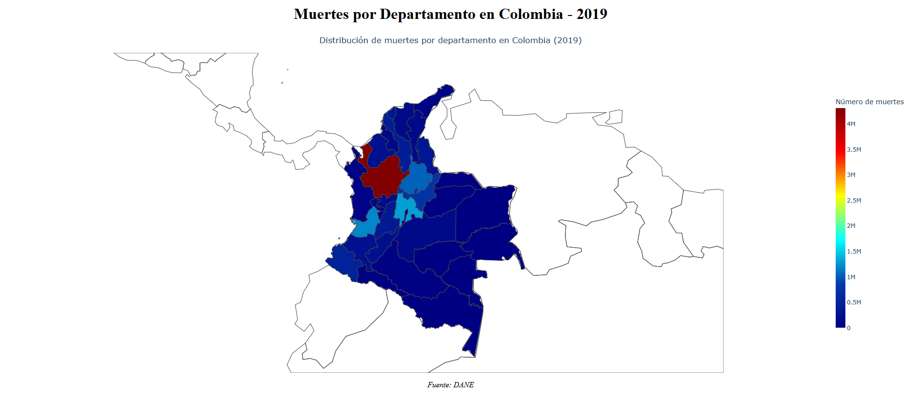
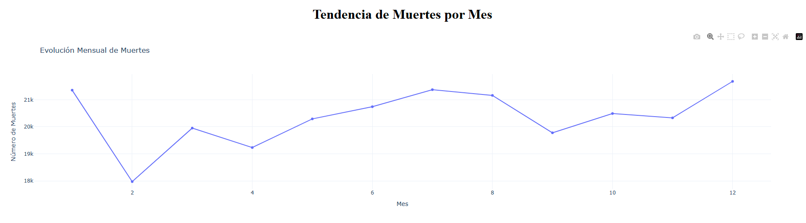
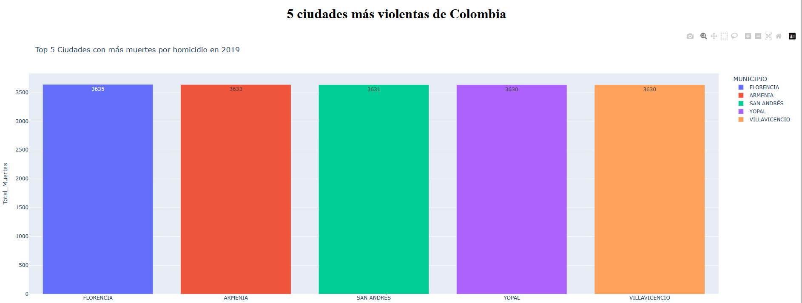
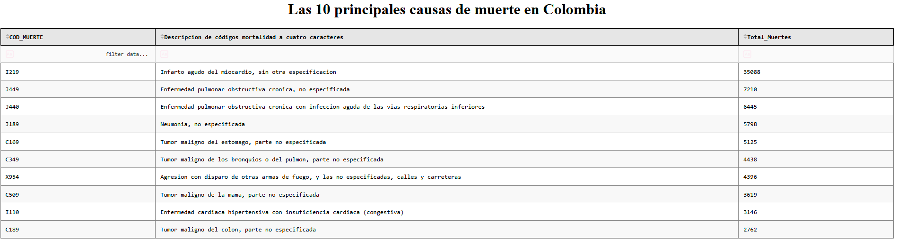

# ** Aplicación web interactiva para el análisis de mortalidad en Colombia**
Esteban Murcia Saavedra

>En este repositorio estará alojada la actividad 4 de la asignatura de Aplicaciones I de la maestría en inteligencia artificial


<!-- TABLE OF CONTENTS -->
<details>
  <summary>Tabla de Contenidos</summary>
  <ol>
    <li>
      <a href="#descripcion-de-la-actividad">Descripción de la actividad</a>
    </li>    
    <li>
      <a href="#qué-se-busca-con-esta-actividad">¿Qué se busca con esta actividad?</a>
    </li>  
    <li>
      <a href="#desarrollo-de-la-actividad">Desarrollo de la actividad</a>
      <ul>
        <li><a href="#requerimientos-de-la-actividad">requerimientos-de-la-actividad</a></li>
        <li><a href="#requerimientos">Requerimientos</a></li>
        <li><a href="#instalacion">Instalacion</a></li>
      </ul>
    </li>
    <li><a href="#estructura-de-carpetas">Estructura de carpetas</a></li>
    <li><a href="#marco-teórico">Marco Teorico</a>
    </li>
    <li><a href="#despliegue-de-la-aplicación-en-render">Despliegue de la Aplicación en Render</a></li>
    <li><a href="#graficos-generados">Graficos generados</a></li>
    <li><a href="#conclusiones">Conclusiones</a></li>

  </ol>
</details>

## **Descripcion de la actividad**

Analizar los datos de mortalidad en Colombia (2019) y desarrollar una aplicación web interactiva con Plotly y Dash en Python, integrando visualizaciones dinámicas para una exploración intuitiva. Desplegar la aplicación en una plataforma PaaS (Render, Railway, Google App Engine o AWS) para garantizar su acceso en línea.

### ¿Qué se busca con esta actividad?

Desarrollar habilidades en análisis de datos mediante herramientas de visualización interactiva (Plotly y Dash) para transformar datos complejos en gráficos comprensibles, identificar patrones en la mortalidad en Colombia y fortalecer competencias en desarrollo y despliegue de aplicaciones web en plataformas PaaS.

## **Desarrollo de la actividad**

Esta aplicación web fue desarrollada en  <a href="https://www.python.org/">Python</a>, utilizando bibliotecas como  <a href="https://dash.plotly.com/">Dash</a> para el despliegue de soluciones web interactivas y la creación de graficos dinámicos.

### Requerimientos de la actividad

Para la visualización y creación de gráficos, se analizarán los datos contenidos en:

<a href="src\data\_Anexo2.CodigosDeMuerte_CE_15-03-23.xlsx">_Anexo2.CodigosDeMuerte_CE_15-03-23.xlsx</a>

<a href="src\data\Anexo1.NoFetal2019_CE_15-03-23.xlsx">Anexo1.NoFetal2019_CE_15-03-23.xlsx</a>

<a href="src\data\Divipola_CE_.xlsx">Divipola_CE_.xlsx</a>

### Requerimientos
Antes de entrar en materia y en conceptos, se requiere un ambiente con:

```markdown
atomicwrites==1.4.1
attrs==25.3.0
blinker==1.9.0
certifi==2025.4.26
cfgv==3.4.0
charset-normalizer==3.4.2
click==8.2.0
colorama==0.4.6
dash==3.0.4
dash-bootstrap-components==2.0.2
dash-core-components==2.0.0
dash-html-components==2.0.0
dash-iconify==0.1.2
dash-mantine-components==0.12.0
dash-tools==1.12.0
dash_renderer==1.9.1
distlib==0.3.9
docopt==0.6.2
et_xmlfile==2.0.0
filelock==3.18.0
Flask==3.0.3
greenlet==3.2.2
gunicorn==23.0.0
identify==2.6.10
idna==3.10
importlib_metadata==8.7.0
iniconfig==2.1.0
itsdangerous==2.2.0
Jinja2==3.1.6
MarkupSafe==3.0.2
narwhals==1.40.0
nest-asyncio==1.6.0
nodeenv==1.9.1
numpy==2.2.6
openpyxl==3.1.5
packaging==21.3
pandas==2.2.3
pandasql==0.7.3
pipreqs==0.4.12
platformdirs==4.3.8
plotly==6.1.0
pluggy==1.6.0
pre-commit==2.16.0
py==1.11.0
pyparsing==3.2.3
pytest==6.2.5
python-dateutil==2.9.0.post0
pytz==2025.2
PyYAML==6.0.2
requests==2.32.3
retrying==1.3.4
ruamel.yaml==0.17.21
setuptools==80.7.1
six==1.17.0
SQLAlchemy==2.0.41
termcolor==1.1.0
toml==0.10.2
typing_extensions==4.13.2
tzdata==2025.2
urllib3==2.4.0
virtualenv==20.31.2
visdcc==0.0.50
Werkzeug==3.0.6
yarg==0.1.10
yolk3k==0.9
zipp==3.21.0
```

### Instalacion

Se recomienda realizar esta instalación mediante los siguientes comandos y a partir del documento <a href="requirements.txt">requirements.txt</a>:

```bash
git clone https://github.com/EstebanMS77/Maestria_IA_AplicacionI_Actividad4.git

cd Maestria_IA_AplicacionI_Actividad4

python -m venv venv
.\venv\Scripts\activate   

git checkout master
# Instalar dependencias
pip install -r requirements.txt

# Ejecutar aplicación
python src\app.py
```

Aun asi esta aplicacion sera desplegada en la siguiente url <a href="https://maestria-ia-aplicacioni-actividad4.onrender.com/">Aplicación web interactiva para el análisis de mortalidad en Colombia</a>

### **Estructura de carpetas**

Una vez garantizado lo anterior, contará con la siguiente estructura de carpetas, en esta encontrará los archivos más relevantes:

```bash
Actividad4/
├── README.md
├── .gitattributes
├── render.yaml
├── requirements.txt
├── .venv/                
├── src/                    
│   ├── app.py
│   ├── data/
```

### Marco Teórico

#### **Python**

Lenguaje de programación Python por su tipado dinámico, sintaxis clara y enfoque multiparadigma. Utilizarlo para desarrollar aplicaciones de alto nivel de forma rápida y mantenible, aprovechando su amplia comunidad y ecosistema de bibliotecas especializadas. Integrar sus características con herramientas externas para desarrollar interfaces gráficas, manipulación de datos y control de lógica de negocio.

#### **Dash**

Dash es un framework de código abierto desarrollado por Plotly, diseñado para crear aplicaciones web analíticas interactivas en Python. Su integración con bibliotecas como Plotly, Pandas y Scikit-learn permite transformar datos complejos en visualizaciones dinámicas con componentes interactivos (dropdowns, sliders, gráficos)


#### **Plataformas como Servicio (PaaS) para Despliegue**

Un PaaS (Platform as a Service) elimina la necesidad de gestionar infraestructura, ofreciendo entornos preconfigurados para despliegue de aplicaciones. Para Dash, destacan:

Render: Ideal para proyectos pequeños/medianos, con configuración sencilla vía requirements.txt y soporte para Web Services.

### **Despliegue de la Aplicación en Render**

La aplicación fue desplegada en Render (https://render.com/), una plataforma PaaS (Platform as a Service) que simplifica el despliegue de aplicaciones web con soporte para Python, bases de datos y despliegue continuo desde GitHub.

#### **Preparación del Entorno**
Estructura del Proyecto:

Se organizó el código en carpetas modulares para cumplir con los requisitos de Render.

Archivos clave:

app/app.py (aplicación Dash principal).

<a href="requirements.txt">requirements.txt</a> (dependencias).

<a href="render.yaml">render.yaml</a> (configuración).

El archivo render permite la configuracion de nuestro ambiente, definiendo asi las lineas de codigo a lanzar, la version de python requerida, y sus dichas dependencias, el contenido del render.yaml y la respectiva aplicacion, es el sigueinte:

```bash

services:

  - type: web
    name: Aplicación web interactiva para el análisis de mortalidad en Colombia
    env : python
    plan : free

    buildCommands:
      - pip install -r requirements.txt

    startupCommands:
      - gunicorn --chdir src app:server
    
    envVars:
      - key: PYTHON_VERS
        value: 3.12.8

```

### Graficos generados

Dato los datos anteriores se proceden a realizar los sigueintes graficos:

- Mapa: Visualización de la distribución total de muertes por departamento en Colombia para el año 2019.

Para llevar a cabo este, se deben tener en cuenta las cordenadas geograficas de nuestras regiones, las cuales se encuentra alojadas en <a href="src\data\Colombia.geo.json">Colombia.geo.json</a>, ademas de esto para poder realizar el cruce respectivo, este se realizo mediante la libreria de PandasSQl, en donde el respectivo query es el siguiente: 

```SQL
SELECT Df_CD.DEPARTAMENTO, Df_CD.COD_DEPARTAMENTO, COUNT(Df_CD.DEPARTAMENTO) AS Total_Muertes
FROM df_Codigos_Departamento as Df_CD
INNER JOIN df_Data_Muertes as Df_DM ON Df_DM.COD_DEPARTAMENTO = Df_CD.COD_DEPARTAMENTO 
GROUP BY Df_CD.DEPARTAMENTO, Df_CD.COD_DEPARTAMENTO
```

como podemos ver en la consulta anterior este nos permitira crear la consulta requerida para suplir con dicha grafica, una vez obtenido el daframe a utilizar procedemos a definir la figura mediante dash:

```python
fig = px.choropleth(
    df_Total_Muertes,
    geojson=geojson_col,
    locations='COD_DEPARTAMENTO', 
    featureidkey='properties.DPTO', 
    color='Total_Muertes',  
    color_continuous_scale="Jet",
    range_color=(0, df_Total_Muertes['Total_Muertes'].max()),
    labels={'Total_Muertes': 'Número de muertes'},
    title='Distribución de muertes por departamento en Colombia (2019)',
)
```

Este sera el primer grafico alojado en nuestro layout de la aplicacion, dado como resultado lo siguiente:



Como se puede observar este genero un mapa de calor interactivo, que permitio una comprension más grafica de los datos, este comprension se genera gracias a la representacion mediante una escala de colores, de los departamentos con más indice de muertes, visualmente podemos concluir que el departamento de Antioquia presenta un indice de fallecimientos alto, y regiones como el Amazonas presenta un indice muchisimo menor.

- Gráfico de líneas: Representación del total de muertes por mes en Colombia, mostrando variaciones a lo largo del año.

Para llevar acabo este grafico se procede a relaizar tambien un cruce de informacion mediante una consulta SQL, permitiendo generar el dataframe requerido:

```SQL
SELECT MES, COUNT(MES) AS Muertes
FROM df_Data_Muertes
GROUP BY MES ORDER BY MES DESC   
```

Una vez obtenido esto, se procede a generar la respectiva grafica mediante la siguiente linea de comandos de Python:

```python
html.Div([

    html.H1('Tendencia de Muertes por Mes', style={'textAlign': 'center'}),
    
    dcc.Graph(
        id='line-chart',
        figure=px.line(
            df_TotalPorMes,
            x='MES',
            y='Muertes',
            title='Evolución Mensual de Muertes',
            markers=True,  # Muestra puntos en cada dato
            template='plotly_white'
        ).update_layout(
            xaxis_title='Mes',
            yaxis_title='Número de Muertes',
            hovermode='x unified'
        )
    )
])
```

como podemos observar este se genero directamente dentro del layout de la aplicación dando como resultado lo siguiente:



Este resultados nos da a entender de mejor forma el comportamiento de los datos, la fatalidad presentada en todos los meses del año 2019, de esta forma podemos concluir que los meses en los que más se presentan festividades: Enero,Mitad de año y Diciembre, son los meses que más se presentan fallecimientos.

- Gráfico de barras: Visualización de las 5 ciudades más violentas de Colombia, considerando homicidios (códigos X95, agresión con disparo de armas de fuego y casos no especificados).

Siguiendo la metodologia anterior se realizo un dataframe que solvente esta solicitud donde se obtiene lo siguiente:

```SQL
SELECT Df_CD.MUNICIPIO,COUNT(Df_CD.MUNICIPIO) AS Total_Muertes FROM df_Data_Muertes AS Df_DM
INNER JOIN df_Codigos_Muerte as Df_CM ON Df_CM.[Código de la CIE-10 cuatro caracteres] = Df_DM.COD_MUERTE
INNER JOIN df_Codigos_Departamento as Df_CD ON Df_DM.COD_MUNICIPIO = Df_CD.COD_MUNICIPIO 
WHERE DF_DM.COD_MUERTE IN ('X950','X951','X952','X953','X954','X955','X956','X957','X958','X959')
GROUP BY Df_CD.MUNICIPIO ORDER BY Total_Muertes DESC LIMIT 5
```
Como se puede evidenciar en la consulta anterior se tiene como criterio un listado de codigos, una agrupacion por municipio y el total de muertes por municipio

```python
fig_bar = px.bar(
        df_TopCiudades,
        x='MUNICIPIO',
        y='Total_Muertes',
        color='MUNICIPIO',
        text_auto=True,
        title='Top 5 Ciudades con más muertes por homicidio en 2019',
        labels={
            'Total_Muertes': 'Total_Muertes',
            'MUNICIPIO': 'MUNICIPIO',
        },
        height=500
    )
```
Dando como resultado la siguiente grafica:



Como podemos obserbar la tendencia de estos fallecimientos es la misma a lo largo del año 2019.

- Tabla: Listado de las 10 principales causas de muerte en Colombia, incluyendo su código, nombre y total de casos (ordenadas de mayor a menor).

Para dar cumplimiento a esta grafica se requiere las siguientes lineas de codigo:

```SQL
SELECT Df_DM.COD_MUERTE, Df_CM.[Descripcion  de códigos mortalidad a cuatro caracteres], COUNT(Df_DM.COD_MUERTE) AS Total_Muertes FROM df_Data_Muertes AS Df_DM
INNER JOIN df_Codigos_Muerte as Df_CM ON Df_CM.[Código de la CIE-10 cuatro caracteres] = Df_DM.COD_MUERTE
GROUP BY  Df_DM.COD_MUERTE ORDER BY Total_Muertes DESC LIMIT 10

```
```python
html.Div([
    html.H1('Las 10 principales causas de muerte en Colombia', style={'textAlign': 'center'}),
    dash_table.DataTable(
    id='table',
    columns=[{"name": i, "id": i} for i in df_TablaCiudades.columns],
    data=df_TablaCiudades.to_dict('records'),
    style_table={'overflowX': 'auto'},  # Permite scroll horizontal
    style_cell={
        'textAlign': 'left',
        'padding': '10px',
        'whiteSpace': 'normal',
        'height': 'auto',
    },
    style_header={
        'backgroundColor': 'rgb(230, 230, 230)',
        'fontWeight': 'bold',
        'border': '1px solid black'
    },
    style_data={
        'border': '1px solid grey'
    },
    style_data_conditional=[
        {
            'if': {'row_index': 'odd'},
            'backgroundColor': 'rgb(248, 248, 248)'
        }
    ],
    filter_action="native",  # Permite filtrado
    sort_action="native",    # Permite ordenamiento
    page_action="native",    # Paginación
    page_size=10             # 10 filas por página
)
])
```

Dando como resultado lo siguiente:



Como podemos observar la mayor causa de fatalidad del año 2019 fue "Infarto agudo del miocardio, sin otra especificacion", aun asi podemos concluir que el top 10 de formas de mortalidad, radica principalmente en enfermedades cardiacas y pulmonares

### Conclusiones

1. Importancia de los Gráficos en el Análisis de Datos
Los gráficos son fundamentales para transformar datos complejos en información accionable, ya que:

    Simplifican patrones y tendencias: Permiten identificar rápidamente correlaciones, outliers o comportamientos atípicos (ej: picos de mortalidad en una región).

    Facilitan la comunicación: Una visualización clara es más efectiva que tablas numéricas para transmitir hallazgos a stakeholders no técnicos.

    Apoyan la toma de decisiones: En salud pública, economía o negocios, los gráficos son la base para políticas o estrategias basadas en evidencia.

2. Ventajas de las Librerías de Gráficos Dinámicos (Plotly, Dash)
Herramientas como Dash y Plotly elevan el análisis tradicional al permitir:

    Interactividad: Los usuarios pueden filtrar datos (por año, región, etc.) y explorar perspectivas personalizadas.

    Actualización en tiempo real: Conectándose a bases de datos o APIs, los gráficos reflejan cambios inmediatos.

    Profesionalismo: Crean dashboards comparables a soluciones empresariales (ej: Power BI) pero con mayor flexibilidad y código abierto.

3. Valor de las Herramientas en la Nube (PaaS)
Desplegar aplicaciones en plataformas como Render, Railway o AWS garantiza:

    Acceso global: Disponibilidad 24/7 desde cualquier dispositivo con internet.

    Escalabilidad: Ajuste automático de recursos ante alta demanda.

    Mantenimiento mínimo: Sin preocuparse por servidores físicos, actualizaciones o seguridad básica.

